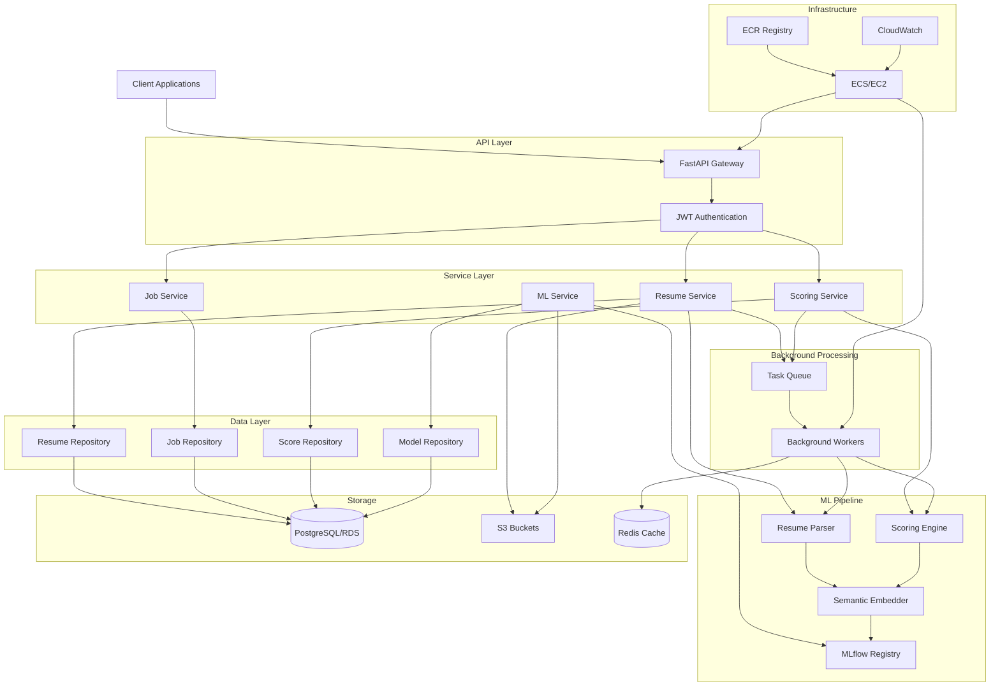

# Design Document: TalentFlow AI

## Overview

TalentFlow AI is an intelligent hiring platform built on a modern microservices architecture with ML/AI capabilities at its core. The system follows clean architecture principles with clear separation between API layer, business logic, data access, and ML inference components.

The platform is designed for scalability and maintainability, with containerized services deployed on AWS infrastructure. The ML pipeline implements MLOps best practices using MLflow for experiment tracking and model registry, enabling continuous model improvement and deployment.

### Key Design Principles

1. **Clean Architecture**: Clear separation of concerns with routers, services, and repositories
2. **Async-First**: Non-blocking I/O for high throughput and responsiveness
3. **ML-Powered**: Semantic similarity models for intelligent candidate matching
4. **Cloud-Native**: Designed for AWS with infrastructure as code
5. **API-First**: Well-documented REST APIs as the primary interface
6. **Observable**: Comprehensive logging, monitoring, and drift detection

## Architecture

### High-Level Architecture



### Component Interaction Flow

**Resume Upload Flow:**
1. Client uploads resume via API Gateway
2. API validates authentication and file format
3. Resume Service stores file in S3 and queues parsing job
4. Background Worker retrieves file and invokes Resume Parser
5. Parser extracts text and structured data
6. Structured data is stored in Candidate Repository
7. Client receives job ID for status tracking

**Candidate Scoring Flow:**
1. Client requests scoring for candidate-job pair
2. Scoring Service retrieves candidate and job data
3. Scoring Engine loads model from MLflow
4. Engine computes semantic embeddings for resume and job description
5. Similarity score is calculated and stored
6. Optional: LLM generates explanation for score
7. Score and explanation returned to client

**Model Training Flow:**
1. Data scientist triggers training via ML Service
2. Training script loads data from database
3. Model is trained with hyperparameter logging to MLflow
4. Trained model is registered in Model Registry
5. Model artifacts stored in S3
6. CI/CD pipeline optionally deploys new model version

## Components and Interfaces

### 1. API Gateway (FastAPI)

**Responsibilities:**
- HTTP request routing and validation
- Authentication and authorization
- Request/response serialization
- OpenAPI documentation generation
- Rate limiting and CORS handling

**Key Endpoints:**

```python
# Authentication
POST /api/v1/auth/login
POST /api/v1/auth/register
POST /api/v1/auth/refresh

# Resume Management
POST /api/v1/resumes/upload
GET /api/v1/resumes/{resume_id}
GET /api/v1/resumes
DELETE /api/v1/resumes/{resume_id}

# Job Management
POST /api/v1/jobs
GET /api/v1/jobs/{job_id}
PUT /api/v1/jobs/{job_id}
DELETE /api/v1/jobs/{job_id}
GET /api/v1/jobs

# Candidate Scoring
POST /api/v1/scores/compute
GET /api/v1/scores/{score_id}
GET /api/v1/jobs/{job_id}/candidates
GET /api/v1/jobs/{job_id}/top-candidates

# Background Jobs
GET /api/v1/jobs/status/{job_id}

# Model Management
GET /api/v1/models
GET /api/v1/models/{model_id}
POST /api/v1/models/promote
```

**Interface Contracts:**

```python
# Resume Upload Request
class ResumeUploadRequest:
    file: UploadFile  # PDF or DOCX
    candidate_name: Optional[str]
    metadata: Optional[Dict[str, Any]]

# Resume Upload Response
class ResumeUploadResponse:
    resume_id: str
    job_id: str  # Background job ID
    status: str  # "queued", "processing", "completed", "failed"

# Job Creation Request
class JobCreateRequest:
    title: str
    description: str
    required_skills: List[str]
    experience_level: str  # "entry", "mid", "senior"
    location: Optional[str]
    salary_range: Optional[Dict[str, float]]

# Scoring Request
class ScoringRequest:
    candidate_id: str
    job_id: str
    generate_explanation: bool = False

# Scoring Response
class ScoringResponse:
    score_id: str
    candidate_id: str
    job_id: str
    score: float  # 0.0 to 1.0
    explanation: Optional[str]
    timestamp: datetime
```

### 2. Resume Service

**Responsibilities:**
- Resume file validation and storage
- Coordination with Resume Parser
- Candidate data management
- Resume retrieval and search

**Key Methods:**

```python
class ResumeService:
    async def upload_resume(
        self, 
        file: UploadFile, 
        metadata: Dict[str, Any]
    ) -> ResumeUploadResponse:
        """
        Validates and stores resume file, queues parsing job.
        Returns job ID for status tracking.
        """
        pass
    
    async def get_resume(self, resume_id: str) -> Resume:
        """Retrieves resume by ID with parsed data."""
        pass
    
    async def search_resumes(
        self, 
        filters: Dict[str, Any]
    ) -> List[Resume]:
        """Searches resumes by skills, experience, etc."""
        pass
    
    async def delete_resume(self, resume_id: str) -> bool:
        """Soft deletes resume and associated data."""
        pass
```

### 3. Resume Parser

**Responsibilities:**
- Text extraction from PDF/DOCX files
- Section identification (experience, education, skills)
- Named entity recognition for structured data extraction
- Confidence scoring for extracted fields

**Implementation Approach:**

The Resume Parser uses a multi-stage pipeline:

1. **Text Extraction**: PyPDF2 for PDFs, python-docx for DOCX
2. **Section Detection**: Rule-based patterns + ML classifier
3. **Entity Extraction**: spaCy NER models + custom patterns
4. **Structured Output**: JSON schema with confidence scores

**Key Methods:**

```python
class ResumeParser:
    def parse_resume(self, file_path: str) -> ParsedResume:
        """
        Extracts structured data from resume file.
        Returns ParsedResume with confidence scores.
        """
        pass
    
    def extract_text(self, file_path: str) -> str:
        """Extracts raw text from PDF or DOCX."""
        pass
    
    def identify_sections(self, text: str) -> Dict[str, str]:
        """Identifies resume sections and their content."""
        pass
    
    def extract_entities(
        self, 
        section: str, 
        text: str
    ) -> List[Entity]:
        """Extracts structured entities from section text."""
        pass
```

**Data Model:**

```python
class ParsedResume:
    candidate_name: str
    email: Optional[str]
    phone: Optional[str]
    work_experience: List[WorkExperience]
    education: List[Education]
    skills: List[str]
    certifications: List[str]
    confidence_scores: Dict[str, float]

class WorkExperience:
    company: str
    title: str
    start_date: Optional[date]
    end_date: Optional[date]
    description: str
    confidence: float

class Education:
    institution: str
    degree: str
    field_of_study: Optional[str]
    graduation_date: Optional[date]
    confidence: float
```

### 4. Scoring Engine

**Responsibilities:**
- Semantic embedding generation
- Similarity computation
- Candidate ranking
- Score explanation generation (optional)

**ML Model Architecture:**

**Baseline Model:**
- TF-IDF vectorization of resume and job description
- Cosine similarity for matching
- Weighted scoring across sections

**Advanced Model:**
- Sentence Transformers (e.g., all-MiniLM-L6-v2) for embeddings
- Separate embeddings for skills, experience, education
- Weighted combination with learned weights
- Optional: XGBoost for final ranking with features

**Key Methods:**

```python
class ScoringEngine:
    def __init__(self, model_version: str = "latest"):
        """Loads model from MLflow registry."""
        self.model = self._load_model(model_version)
        self.embedder = self._load_embedder()
    
    async def score_candidate(
        self, 
        resume: ParsedResume, 
        job: Job
    ) -> ScoringResult:
        """
        Computes similarity score between resume and job.
        Returns score in range [0, 1].
        """
        pass
    
    def generate_embeddings(self, text: str) -> np.ndarray:
        """Generates semantic embeddings for text."""
        pass
    
    def compute_similarity(
        self, 
        resume_embedding: np.ndarray, 
        job_embedding: np.ndarray
    ) -> float:
        """Computes cosine similarity between embeddings."""
        pass
    
    async def explain_score(
        self, 
        resume: ParsedResume, 
        job: Job, 
        score: float
    ) -> str:
        """
        Generates natural language explanation for score.
        Optional: Uses LLM for explanation generation.
        """
        pass
```

**Scoring Algorithm:**

```
1. Extract key sections from resume and job description
2. Generate embeddings for each section:
   - Skills embedding
   - Experience embedding
   - Education embedding
   - Overall description embedding

3. Compute section-wise similarities:
   - skills_sim = cosine(resume_skills_emb, job_skills_emb)
   - exp_sim = cosine(resume_exp_emb, job_exp_emb)
   - edu_sim = cosine(resume_edu_emb, job_edu_emb)

4. Weighted combination:
   final_score = (
       0.4 * skills_sim + 
       0.4 * exp_sim + 
       0.2 * edu_sim
   )

5. Normalize to [0, 1] range
```

### 5. Job Service

**Responsibilities:**
- Job description CRUD operations
- Job search and filtering
- Job-candidate association management

**Key Methods:**

```python
class JobService:
    async def create_job(self, job_data: JobCreateRequest) -> Job:
        """Creates new job posting."""
        pass
    
    async def get_job(self, job_id: str) -> Job:
        """Retrieves job by ID."""
        pass
    
    async def update_job(
        self, 
        job_id: str, 
        updates: Dict[str, Any]
    ) -> Job:
        """Updates job with version history."""
        pass
    
    async def search_jobs(
        self, 
        filters: Dict[str, Any]
    ) -> List[Job]:
        """Searches jobs by criteria."""
        pass
    
    async def get_candidates_for_job(
        self, 
        job_id: str, 
        min_score: float = 0.0
    ) -> List[CandidateScore]:
        """Returns ranked candidates for job."""
        pass
```

### 6. Background Processor

**Responsibilities:**
- Asynchronous task execution
- Job queue management
- Retry logic for failed tasks
- Progress tracking

**Implementation:**

Using FastAPI BackgroundTasks for simple async operations, with option to upgrade to Celery for distributed processing.

**Key Components:**

```python
class BackgroundProcessor:
    def __init__(self, redis_url: str):
        self.queue = Queue(redis_url)
    
    async def enqueue_task(
        self, 
        task_type: str, 
        task_data: Dict[str, Any]
    ) -> str:
        """Enqueues task and returns job ID."""
        pass
    
    async def get_task_status(self, job_id: str) -> TaskStatus:
        """Returns current status of background task."""
        pass
    
    async def process_resume_parsing(
        self, 
        resume_id: str, 
        file_path: str
    ):
        """Background task for resume parsing."""
        pass
    
    async def process_batch_scoring(
        self, 
        job_id: str, 
        candidate_ids: List[str]
    ):
        """Background task for batch candidate scoring."""
        pass
```

### 7. Model Registry (MLflow)

**Responsibilities:**
- Model versioning and metadata storage
- Experiment tracking
- Model artifact storage
- Model promotion workflow

**Integration:**

```python
class ModelRegistry:
    def __init__(self, tracking_uri: str):
        mlflow.set_tracking_uri(tracking_uri)
    
    def log_model(
        self, 
        model: Any, 
        model_name: str, 
        metrics: Dict[str, float],
        params: Dict[str, Any]
    ) -> str:
        """Logs model to MLflow with metrics and params."""
        pass
    
    def load_model(
        self, 
        model_name: str, 
        version: str = "latest"
    ) -> Any:
        """Loads model from registry."""
        pass
    
    def promote_model(
        self, 
        model_name: str, 
        version: str, 
        stage: str = "Production"
    ):
        """Promotes model version to specified stage."""
        pass
    
    def compare_models(
        self, 
        model_name: str, 
        versions: List[str]
    ) -> pd.DataFrame:
        """Compares metrics across model versions."""
        pass
```

### 8. Authentication Service

**Responsibilities:**
- User authentication
- JWT token generation and validation
- Role-based access control
- Password hashing and verification

**Key Methods:**

```python
class AuthService:
    def __init__(self, secret_key: str):
        self.secret_key = secret_key
    
    async def authenticate_user(
        self, 
        username: str, 
        password: str
    ) -> Optional[User]:
        """Validates credentials and returns user."""
        pass
    
    def create_access_token(
        self, 
        user_id: str, 
        role: str
    ) -> str:
        """Generates JWT access token."""
        pass
    
    def verify_token(self, token: str) -> Dict[str, Any]:
        """Validates JWT and returns payload."""
        pass
    
    def hash_password(self, password: str) -> str:
        """Hashes password using bcrypt."""
        pass
    
    def check_permission(
        self, 
        user_role: str, 
        required_role: str
    ) -> bool:
        """Checks if user has required permission."""
        pass
```

## Data Models

### Database Schema

```sql
-- Users table
CREATE TABLE users (
    id UUID PRIMARY KEY DEFAULT gen_random_uuid(),
    username VARCHAR(255) UNIQUE NOT NULL,
    email VARCHAR(255) UNIQUE NOT NULL,
    password_hash VARCHAR(255) NOT NULL,
    role VARCHAR(50) NOT NULL,  -- 'admin', 'recruiter', 'hiring_manager'
    created_at TIMESTAMP DEFAULT CURRENT_TIMESTAMP,
    updated_at TIMESTAMP DEFAULT CURRENT_TIMESTAMP
);

-- Jobs table
CREATE TABLE jobs (
    id UUID PRIMARY KEY DEFAULT gen_random_uuid(),
    title VARCHAR(255) NOT NULL,
    description TEXT NOT NULL,
    required_skills TEXT[] NOT NULL,
    experience_level VARCHAR(50) NOT NULL,
    location VARCHAR(255),
    salary_min DECIMAL(10, 2),
    salary_max DECIMAL(10, 2),
    status VARCHAR(50) DEFAULT 'active',  -- 'active', 'inactive', 'closed'
    created_by UUID REFERENCES users(id),
    created_at TIMESTAMP DEFAULT CURRENT_TIMESTAMP,
    updated_at TIMESTAMP DEFAULT CURRENT_TIMESTAMP
);

-- Job history for version tracking
CREATE TABLE job_history (
    id UUID PRIMARY KEY DEFAULT gen_random_uuid(),
    job_id UUID REFERENCES jobs(id),
    title VARCHAR(255),
    description TEXT,
    required_skills TEXT[],
    changed_by UUID REFERENCES users(id),
    changed_at TIMESTAMP DEFAULT CURRENT_TIMESTAMP
);

-- Candidates table
CREATE TABLE candidates (
    id UUID PRIMARY KEY DEFAULT gen_random_uuid(),
    name VARCHAR(255) NOT NULL,
    email VARCHAR(255),
    phone VARCHAR(50),
    resume_file_path VARCHAR(500) NOT NULL,  -- S3 path
    parsed_data JSONB,  -- Structured resume data
    skills TEXT[],
    experience_years INTEGER,
    education_level VARCHAR(100),
    created_at TIMESTAMP DEFAULT CURRENT_TIMESTAMP,
    updated_at TIMESTAMP DEFAULT CURRENT_TIMESTAMP
);

-- Scores table
CREATE TABLE scores (
    id UUID PRIMARY KEY DEFAULT gen_random_uuid(),
    candidate_id UUID REFERENCES candidates(id),
    job_id UUID REFERENCES jobs(id),
    score DECIMAL(5, 4) NOT NULL,  -- 0.0000 to 1.0000
    model_version VARCHAR(100) NOT NULL,
    explanation TEXT,
    is_current BOOLEAN DEFAULT TRUE,  -- Flag for outdated scores
    created_at TIMESTAMP DEFAULT CURRENT_TIMESTAMP,
    UNIQUE(candidate_id, job_id, model_version)
);

-- Model versions table
CREATE TABLE model_versions (
    id UUID PRIMARY KEY DEFAULT gen_random_uuid(),
    model_name VARCHAR(255) NOT NULL,
    version VARCHAR(50) NOT NULL,
    mlflow_run_id VARCHAR(255),
    stage VARCHAR(50) DEFAULT 'None',  -- 'None', 'Staging', 'Production'
    metrics JSONB,
    params JSONB,
    artifact_path VARCHAR(500),  -- S3 path
    created_at TIMESTAMP DEFAULT CURRENT_TIMESTAMP,
    UNIQUE(model_name, version)
);

-- Background jobs table
CREATE TABLE background_jobs (
    id UUID PRIMARY KEY DEFAULT gen_random_uuid(),
    job_type VARCHAR(100) NOT NULL,  -- 'resume_parsing', 'batch_scoring'
    status VARCHAR(50) NOT NULL,  -- 'queued', 'processing', 'completed', 'failed'
    input_data JSONB,
    result_data JSONB,
    error_message TEXT,
    created_at TIMESTAMP DEFAULT CURRENT_TIMESTAMP,
    started_at TIMESTAMP,
    completed_at TIMESTAMP
);

-- Indexes for performance
CREATE INDEX idx_jobs_status ON jobs(status);
CREATE INDEX idx_candidates_skills ON candidates USING GIN(skills);
CREATE INDEX idx_scores_job_score ON scores(job_id, score DESC);
CREATE INDEX idx_scores_candidate ON scores(candidate_id);
CREATE INDEX idx_background_jobs_status ON background_jobs(status);
```

### Python Data Models (Pydantic)

```python
from pydantic import BaseModel, EmailStr, Field
from typing import Optional, List, Dict, Any
from datetime import datetime
from enum import Enum

class UserRole(str, Enum):
    ADMIN = "admin"
    RECRUITER = "recruiter"
    HIRING_MANAGER = "hiring_manager"

class User(BaseModel):
    id: str
    username: str
    email: EmailStr
    role: UserRole
    created_at: datetime
    updated_at: datetime

class ExperienceLevel(str, Enum):
    ENTRY = "entry"
    MID = "mid"
    SENIOR = "senior"
    LEAD = "lead"

class JobStatus(str, Enum):
    ACTIVE = "active"
    INACTIVE = "inactive"
    CLOSED = "closed"

class Job(BaseModel):
    id: str
    title: str
    description: str
    required_skills: List[str]
    experience_level: ExperienceLevel
    location: Optional[str] = None
    salary_min: Optional[float] = None
    salary_max: Optional[float] = None
    status: JobStatus = JobStatus.ACTIVE
    created_by: str
    created_at: datetime
    updated_at: datetime

class WorkExperience(BaseModel):
    company: str
    title: str
    start_date: Optional[str] = None
    end_date: Optional[str] = None
    description: str
    confidence: float = Field(ge=0.0, le=1.0)

class Education(BaseModel):
    institution: str
    degree: str
    field_of_study: Optional[str] = None
    graduation_date: Optional[str] = None
    confidence: float = Field(ge=0.0, le=1.0)

class ParsedResume(BaseModel):
    candidate_name: str
    email: Optional[EmailStr] = None
    phone: Optional[str] = None
    work_experience: List[WorkExperience] = []
    education: List[Education] = []
    skills: List[str] = []
    certifications: List[str] = []
    confidence_scores: Dict[str, float] = {}

class Candidate(BaseModel):
    id: str
    name: str
    email: Optional[EmailStr] = None
    phone: Optional[str] = None
    resume_file_path: str
    parsed_data: Optional[ParsedResume] = None
    skills: List[str] = []
    experience_years: Optional[int] = None
    education_level: Optional[str] = None
    created_at: datetime
    updated_at: datetime

class Score(BaseModel):
    id: str
    candidate_id: str
    job_id: str
    score: float = Field(ge=0.0, le=1.0)
    model_version: str
    explanation: Optional[str] = None
    is_current: bool = True
    created_at: datetime

class ModelVersion(BaseModel):
    id: str
    model_name: str
    version: str
    mlflow_run_id: Optional[str] = None
    stage: str = "None"
    metrics: Dict[str, float] = {}
    params: Dict[str, Any] = {}
    artifact_path: str
    created_at: datetime

class BackgroundJobStatus(str, Enum):
    QUEUED = "queued"
    PROCESSING = "processing"
    COMPLETED = "completed"
    FAILED = "failed"

class BackgroundJob(BaseModel):
    id: str
    job_type: str
    status: BackgroundJobStatus
    input_data: Dict[str, Any]
    result_data: Optional[Dict[str, Any]] = None
    error_message: Optional[str] = None
    created_at: datetime
    started_at: Optional[datetime] = None
    completed_at: Optional[datetime] = None
```


## Correctness Properties

*A property is a characteristic or behavior that should hold true across all valid executions of a system—essentially, a formal statement about what the system should do. Properties serve as the bridge between human-readable specifications and machine-verifiable correctness guarantees.*

### Resume Parsing Properties

**Property 1: Resume format handling**
*For any* valid resume file (PDF or DOCX), the Resume_Parser should successfully extract text content and parse it into structured fields with all required sections identified.
**Validates: Requirements 1.1, 1.2**

**Property 2: Resume storage round-trip**
*For any* successfully parsed resume, the system should store both the original file in S3 and structured data in the database, and both should be retrievable using the candidate ID.
**Validates: Requirements 1.3**

**Property 3: Resume validation error handling**
*For any* invalid resume upload (wrong format, corrupted file, missing content), the system should return a descriptive error message that identifies the specific validation failure.
**Validates: Requirements 1.4**

**Property 4: Minimum field extraction**
*For any* parsed resume, the structured output should contain at minimum: candidate name, contact information, work experience, education, and skills fields (even if some are empty).
**Validates: Requirements 1.5**

**Property 5: Candidate ID uniqueness**
*For any* set of parsed resumes, all assigned candidate IDs should be unique across the system.
**Validates: Requirements 1.6**

**Property 6: Section boundary identification**
*For any* resume with clearly marked sections, the Resume_Parser should correctly identify the boundaries between experience, education, and skills sections.
**Validates: Requirements 12.1**

**Property 7: Comprehensive field extraction**
*For any* resume section (work experience, education, skills), the parser should extract all relevant fields: for experience (company, title, dates, description), for education (institution, degree, dates), for skills (technical skills and tools).
**Validates: Requirements 12.2, 12.3, 12.4**

**Property 8: Format robustness**
*For any* resume using standard templates or layouts, the parser should maintain consistent extraction accuracy regardless of the specific format used.
**Validates: Requirements 12.5**

**Property 9: Low confidence flagging**
*For any* extracted field with confidence score below the threshold, the system should flag that field for manual review.
**Validates: Requirements 12.6**

### Job Management Properties

**Property 10: Job creation validation and storage**
*For any* job creation request with all required fields, the system should validate the fields and successfully store the job in the Job_Repository.
**Validates: Requirements 2.1**

**Property 11: Required field enforcement**
*For any* job creation request missing one or more required fields (title, description, required_skills, experience_level), the system should reject the request with a validation error.
**Validates: Requirements 2.2**

**Property 12: Job ID uniqueness**
*For any* set of created jobs, all assigned job IDs should be unique across the system.
**Validates: Requirements 2.3**

**Property 13: Job retrieval round-trip**
*For any* created job, retrieving it by ID should return all the original job details including metadata that was stored during creation.
**Validates: Requirements 2.4**

**Property 14: Job update history preservation**
*For any* job update operation, the system should create a history record with the previous values and timestamp, maintaining a complete audit trail.
**Validates: Requirements 2.5**

**Property 15: Soft delete behavior**
*For any* job deletion operation, the job record should remain in the database but be marked with status='inactive' rather than being physically removed.
**Validates: Requirements 2.6**

### Candidate Scoring Properties

**Property 16: Score bounds**
*For any* candidate-job pair, the computed similarity score should be a numerical value in the range [0.0, 1.0] inclusive.
**Validates: Requirements 3.1, 13.5**

**Property 17: Candidate ranking order**
*For any* set of candidates scored against the same job, when retrieved as a ranked list, the candidates should be ordered in descending order by their scores.
**Validates: Requirements 3.3**

**Property 18: Score persistence round-trip**
*For any* completed scoring operation, the score and timestamp should be persisted to the database and be retrievable using the score ID.
**Validates: Requirements 3.4**

**Property 19: Score explanation generation**
*For any* scoring request with explanation enabled, the system should generate a non-empty natural language explanation for the scoring decision.
**Validates: Requirements 3.5**

**Property 20: Score invalidation on job update**
*For any* job description update, all existing scores associated with that job should have their is_current flag set to false.
**Validates: Requirements 3.6**

**Property 21: Weighted section scoring**
*For any* two resumes that differ only in one section (skills vs experience vs education), the change in score should reflect the configured weights for that section.
**Validates: Requirements 13.3**

**Property 22: A/B testing support**
*For any* candidate-job pair, the system should be able to compute scores using different model versions and compare the results.
**Validates: Requirements 13.6**

### API and Authentication Properties

**Property 23: Authentication requirement**
*For any* API request without a valid JWT token, the system should reject the request before processing any business logic.
**Validates: Requirements 4.2**

**Property 24: Validation error responses**
*For any* API request that fails validation (missing fields, invalid format, etc.), the system should return an appropriate HTTP status code (4xx) and a descriptive error message.
**Validates: Requirements 4.3**

**Property 25: Async operation acknowledgment**
*For any* long-running operation (resume parsing, batch scoring), the API should return an immediate response with a job ID rather than blocking until completion.
**Validates: Requirements 4.5**

**Property 26: Rate limiting enforcement**
*For any* client making requests exceeding the configured rate limit, subsequent requests should be rejected with HTTP 429 status until the rate limit window resets.
**Validates: Requirements 4.6**

**Property 27: CORS header inclusion**
*For any* API response, the response should include appropriate CORS headers (Access-Control-Allow-Origin, etc.) to enable cross-origin requests.
**Validates: Requirements 4.7**

**Property 28: JWT token validation**
*For any* API request with a JWT token, the system should validate both the token signature and expiration, rejecting invalid or expired tokens with appropriate error messages.
**Validates: Requirements 7.2, 7.3**

**Property 29: Authorization enforcement**
*For any* API request where the user's role lacks the required permissions, the system should return HTTP 403 Forbidden status.
**Validates: Requirements 7.5**

**Property 30: Password hashing**
*For any* stored user password, the password should be hashed and salted (never stored in plaintext), and the hash should be verifiable against the original password.
**Validates: Requirements 7.6**

**Property 31: API documentation completeness**
*For any* API endpoint, the OpenAPI specification should include request/response schemas and examples.
**Validates: Requirements 15.3**

### Background Processing Properties

**Property 32: Async task execution**
*For any* background task (resume parsing or batch scoring), the task should execute asynchronously without blocking the API response.
**Validates: Requirements 6.1, 6.2**

**Property 33: Job ID generation**
*For any* queued background task, the system should return a unique job ID that can be used for status tracking.
**Validates: Requirements 6.3**

**Property 34: Job status tracking**
*For any* background job ID, querying the status should return the current state (queued, processing, completed, failed) and progress information.
**Validates: Requirements 6.4**

**Property 35: Job failure handling**
*For any* background job that fails, the system should update the job status to 'failed', log the error message, and make the error retrievable via the job status endpoint.
**Validates: Requirements 6.5**

**Property 36: Retry logic for transient failures**
*For any* background job that fails with a transient error (network timeout, temporary service unavailability), the system should automatically retry the operation before marking it as permanently failed.
**Validates: Requirements 6.6**

### MLOps and Model Management Properties

**Property 37: Training metrics logging**
*For any* model training run, all hyperparameters and training metrics should be logged to MLflow and be retrievable using the run ID.
**Validates: Requirements 5.1**

**Property 38: Model version registration**
*For any* completed model training, the model should be registered in the Model_Registry with a unique version identifier and be retrievable by that version.
**Validates: Requirements 5.2**

**Property 39: Model metadata completeness**
*For any* registered model version, the registry should store and make retrievable: model artifacts, metadata, performance metrics, and hyperparameters.
**Validates: Requirements 5.3**

**Property 40: Model version comparison**
*For any* two model versions of the same model, the system should be able to retrieve and compare their metrics side-by-side.
**Validates: Requirements 5.4**

**Property 41: Production model promotion**
*For any* model promotion to production, querying for the production model should return the newly promoted version, and the previous production model should be demoted.
**Validates: Requirements 5.5**

**Property 42: Model version audit trail**
*For any* model version change (registration, promotion, demotion), the system should create an audit record with timestamp and user information.
**Validates: Requirements 5.6**

**Property 43: Prediction logging**
*For any* scoring request processed by the Scoring_Engine, the system should log both the input features and the output prediction for monitoring purposes.
**Validates: Requirements 10.1**

**Property 44: Data drift computation**
*For any* batch of production predictions, the system should compute drift metrics comparing the input data distribution to the training data distribution.
**Validates: Requirements 10.2**

**Property 45: Drift alerting**
*For any* drift metric that exceeds the configured threshold, the system should generate an alert notification for the data science team.
**Validates: Requirements 10.3**

**Property 46: Performance metrics tracking**
*For any* model in production, the system should track performance metrics over time in MLflow, enabling trend analysis.
**Validates: Requirements 10.4**

**Property 47: Automated retraining trigger**
*For any* drift detection event that exceeds thresholds (when automated retraining is enabled), the system should trigger a model retraining job.
**Validates: Requirements 10.5**

**Property 48: Model deployment automation**
*For any* new model version registered in MLflow (when automated deployment is enabled), the deployment pipeline should trigger deployment to the target environment.
**Validates: Requirements 9.7**

### Data Management Properties

**Property 49: Schema migration versioning**
*For any* database schema change, the system should apply migrations in version-controlled order, tracking which migrations have been applied.
**Validates: Requirements 11.2**

**Property 50: Referential integrity enforcement**
*For any* attempt to delete or modify a record that is referenced by foreign keys, the database should enforce referential integrity constraints (reject or cascade as configured).
**Validates: Requirements 11.3**

**Property 51: Sensitive data encryption**
*For any* sensitive data field (passwords, personal information), the data should be encrypted at rest in the database.
**Validates: Requirements 11.5**

**Property 52: S3 storage with access controls**
*For any* file stored in S3 (resumes, model artifacts), the file should be stored with appropriate access controls preventing unauthorized access.
**Validates: Requirements 8.3**

## Error Handling

### Error Categories

1. **Validation Errors**: Invalid input data, missing required fields
2. **Authentication Errors**: Invalid credentials, expired tokens
3. **Authorization Errors**: Insufficient permissions
4. **Resource Not Found**: Requested entity doesn't exist
5. **Processing Errors**: Resume parsing failures, model inference errors
6. **Infrastructure Errors**: Database connection failures, S3 access errors
7. **Rate Limiting**: Too many requests

### Error Response Format

All API errors follow a consistent JSON format:

```json
{
  "error": {
    "code": "ERROR_CODE",
    "message": "Human-readable error message",
    "details": {
      "field": "specific_field",
      "reason": "detailed explanation"
    },
    "timestamp": "2024-01-15T10:30:00Z",
    "request_id": "uuid"
  }
}
```

### Error Handling Strategies

**Resume Parsing Errors:**
- Gracefully handle corrupted files with descriptive errors
- Return partial results with confidence scores when possible
- Flag low-confidence extractions for manual review
- Retry transient errors (file access issues)

**Model Inference Errors:**
- Fall back to baseline model if advanced model fails
- Return cached scores if available when model is unavailable
- Log all inference errors for monitoring
- Implement circuit breaker for repeated failures

**Database Errors:**
- Implement connection pooling with retry logic
- Use transactions for multi-step operations
- Gracefully handle constraint violations
- Provide meaningful error messages for constraint failures

**S3 Access Errors:**
- Retry with exponential backoff for transient failures
- Validate file existence before processing
- Handle permission errors with clear messages
- Implement presigned URLs for secure access

**Background Job Errors:**
- Implement retry logic with exponential backoff
- Set maximum retry attempts to prevent infinite loops
- Store error details for debugging
- Send notifications for persistent failures

## Testing Strategy

### Dual Testing Approach

The testing strategy combines unit tests and property-based tests for comprehensive coverage:

- **Unit tests**: Verify specific examples, edge cases, and error conditions
- **Property tests**: Verify universal properties across all inputs
- Both approaches are complementary and necessary

### Unit Testing

Unit tests focus on:
- Specific examples that demonstrate correct behavior
- Edge cases (empty inputs, boundary values, special characters)
- Error conditions and exception handling
- Integration points between components
- Mock external dependencies (S3, database, MLflow)

**Example Unit Tests:**
- Test resume parsing with a specific sample resume
- Test job creation with valid and invalid payloads
- Test authentication with known credentials
- Test error responses for specific failure scenarios

### Property-Based Testing

Property tests focus on:
- Universal properties that hold for all inputs
- Comprehensive input coverage through randomization
- Invariants that should never be violated
- Round-trip properties (serialize/deserialize, store/retrieve)

**Configuration:**
- Minimum 100 iterations per property test
- Each test references its design document property
- Tag format: **Feature: talentflow-ai, Property {number}: {property_text}**

**Property Test Library:**
- Python: Use **Hypothesis** for property-based testing
- Generate random but valid test data (resumes, jobs, candidates)
- Use strategies for complex data types (dates, emails, UUIDs)

**Example Property Tests:**
- Generate random resumes and verify all have unique IDs
- Generate random job descriptions and verify required fields are enforced
- Generate random candidate-job pairs and verify scores are in [0, 1]
- Generate random API requests and verify auth is always checked

### Integration Testing

Integration tests verify:
- End-to-end workflows (upload resume → parse → score → retrieve)
- Database transactions and rollbacks
- S3 file storage and retrieval
- MLflow model registration and loading
- Background job processing

### Performance Testing

Performance tests verify:
- API response times under load
- Concurrent request handling
- Database query performance
- Model inference latency
- Background job throughput

### Testing Infrastructure

**Local Testing:**
- Docker Compose for running all services locally
- SQLite or local PostgreSQL for database
- LocalStack for S3 emulation
- Test fixtures and seed data

**CI/CD Testing:**
- Automated test execution on every commit
- Linting and code quality checks (pylint, black, mypy)
- Test coverage reporting (minimum 80% coverage)
- Integration tests in isolated environments

**Test Data Management:**
- Synthetic resume generation for testing
- Anonymized sample data for development
- Separate test database with seed data
- Version-controlled test fixtures

### Monitoring and Observability

**Logging:**
- Structured logging with JSON format
- Log levels: DEBUG, INFO, WARNING, ERROR, CRITICAL
- Request ID tracking across services
- Sensitive data redaction in logs

**Metrics:**
- API request latency and throughput
- Model inference time
- Background job processing time
- Database query performance
- Error rates by endpoint and error type

**Alerting:**
- High error rates
- Slow API responses
- Model drift detection
- Background job failures
- Infrastructure issues (database, S3)

**Dashboards:**
- Real-time API metrics
- Model performance trends
- Background job queue status
- Infrastructure health
- User activity and usage patterns
