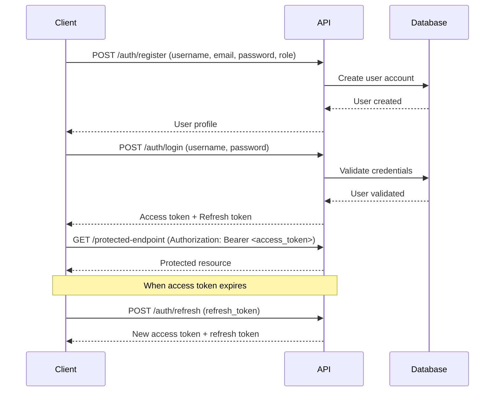

# TalentFlow AI - API Documentation Guide

## Overview

This document provides comprehensive documentation for the TalentFlow AI API, including authentication flows, endpoint usage examples, and best practices for integration.

## Table of Contents

1. [Authentication Flow](#authentication-flow)
2. [API Endpoints](#api-endpoints)
3. [Usage Examples](#usage-examples)
4. [Error Handling](#error-handling)
5. [Rate Limiting](#rate-limiting)
6. [Best Practices](#best-practices)

## Authentication Flow

TalentFlow AI uses JWT (JSON Web Tokens) for authentication with a two-token system:

### Token Types

- **Access Token**: Short-lived (30 minutes) for API requests
- **Refresh Token**: Long-lived (7 days) for obtaining new access tokens

### Authentication Process



### Step-by-Step Authentication

#### 1. User Registration

```bash
curl -X POST "http://localhost:8000/api/v1/auth/register" \
     -H "Content-Type: application/json" \
     -d '{
       "username": "jane_recruiter",
       "email": "jane@company.com",
       "password": "SecurePass123!",
       "role": "recruiter"
     }'
```

Response:
```json
{
  "id": "123e4567-e89b-12d3-a456-426614174000",
  "username": "jane_recruiter",
  "email": "jane@company.com",
  "role": "recruiter"
}
```

#### 2. User Login

```bash
curl -X POST "http://localhost:8000/api/v1/auth/login" \
     -H "Content-Type: application/json" \
     -d '{
       "username": "jane_recruiter",
       "password": "SecurePass123!"
     }'
```

Response:
```json
{
  "access_token": "eyJ0eXAiOiJKV1QiLCJhbGciOiJIUzI1NiJ9...",
  "refresh_token": "eyJ0eXAiOiJKV1QiLCJhbGciOiJIUzI1NiJ9...",
  "token_type": "bearer"
}
```

#### 3. Using Access Token

```bash
curl -X GET "http://localhost:8000/api/v1/auth/me" \
     -H "Authorization: Bearer <access_token>"
```

#### 4. Refreshing Tokens

```bash
curl -X POST "http://localhost:8000/api/v1/auth/refresh" \
     -H "Content-Type: application/json" \
     -d '{
       "refresh_token": "<refresh_token>"
     }'
```

## API Endpoints

### Authentication Endpoints

| Method | Endpoint | Description | Auth Required |
|--------|----------|-------------|---------------|
| POST | `/api/v1/auth/register` | Register new user | No |
| POST | `/api/v1/auth/login` | Login and get tokens | No |
| POST | `/api/v1/auth/refresh` | Refresh access token | No |
| GET | `/api/v1/auth/me` | Get current user info | Yes |

### Resume Management Endpoints

| Method | Endpoint | Description | Auth Required | Role |
|--------|----------|-------------|---------------|------|
| POST | `/api/v1/resumes/upload` | Upload and parse resume | Yes | recruiter+ |
| GET | `/api/v1/resumes/{id}` | Get resume details | Yes | any |
| GET | `/api/v1/resumes/{id}/download` | Download original file | Yes | any |
| GET | `/api/v1/resumes/{id}/url` | Get presigned URL | Yes | any |
| GET | `/api/v1/resumes` | Search resumes | Yes | any |
| DELETE | `/api/v1/resumes/{id}` | Delete resume | Yes | recruiter+ |

### Job Management Endpoints

| Method | Endpoint | Description | Auth Required | Role |
|--------|----------|-------------|---------------|------|
| POST | `/api/v1/jobs` | Create job posting | Yes | hiring_manager+ |
| GET | `/api/v1/jobs/{id}` | Get job details | Yes | any |
| PUT | `/api/v1/jobs/{id}` | Update job | Yes | hiring_manager+ |
| DELETE | `/api/v1/jobs/{id}` | Delete job | Yes | hiring_manager+ |
| GET | `/api/v1/jobs` | Search jobs | Yes | any |
| GET | `/api/v1/jobs/{id}/history` | Get job history | Yes | creator/admin |
| POST | `/api/v1/jobs/{id}/close` | Close job | Yes | creator/admin |
| POST | `/api/v1/jobs/{id}/reopen` | Reopen job | Yes | creator/admin |
| GET | `/api/v1/jobs/{id}/candidates` | Get ranked candidates | Yes | any |
| GET | `/api/v1/jobs/{id}/top-candidates` | Get top candidates | Yes | any |

### Model Management Endpoints

| Method | Endpoint | Description | Auth Required | Role |
|--------|----------|-------------|---------------|------|
| GET | `/api/v1/models` | List all models | Yes | any |
| GET | `/api/v1/models/{name}` | Get model details | Yes | any |
| POST | `/api/v1/models/promote` | Promote model | Yes | admin |
| POST | `/api/v1/models/compare` | Compare models | Yes | any |
| POST | `/api/v1/models/register` | Register model | Yes | admin |
| GET | `/api/v1/models/health` | Check MLflow health | Yes | any |

### Background Job Endpoints

| Method | Endpoint | Description | Auth Required | Role |
|--------|----------|-------------|---------------|------|
| GET | `/api/v1/jobs/status/{id}` | Get job status | Yes | any |
| GET | `/api/v1/jobs/stats` | Get queue stats | Yes | admin |
| POST | `/api/v1/jobs/cleanup` | Cleanup old jobs | Yes | admin |

## Usage Examples

### Complete Resume Processing Workflow

```bash
# 1. Login to get tokens
LOGIN_RESPONSE=$(curl -s -X POST "http://localhost:8000/api/v1/auth/login" \
  -H "Content-Type: application/json" \
  -d '{"username": "jane_recruiter", "password": "SecurePass123!"}')

ACCESS_TOKEN=$(echo $LOGIN_RESPONSE | jq -r '.access_token')

# 2. Upload resume
UPLOAD_RESPONSE=$(curl -s -X POST "http://localhost:8000/api/v1/resumes/upload" \
  -H "Authorization: Bearer $ACCESS_TOKEN" \
  -F "file=@john_doe_resume.pdf" \
  -F "candidate_name=John Doe" \
  -F "candidate_email=john.doe@email.com")

JOB_ID=$(echo $UPLOAD_RESPONSE | jq -r '.job_id')

# 3. Check processing status
curl -X GET "http://localhost:8000/api/v1/jobs/status/$JOB_ID" \
  -H "Authorization: Bearer $ACCESS_TOKEN"

# 4. Get parsed resume data (once completed)
RESUME_ID="<candidate_id_from_job_result>"
curl -X GET "http://localhost:8000/api/v1/resumes/$RESUME_ID" \
  -H "Authorization: Bearer $ACCESS_TOKEN"
```

### Job Creation and Candidate Matching

```bash
# 1. Create job posting
JOB_RESPONSE=$(curl -s -X POST "http://localhost:8000/api/v1/jobs" \
  -H "Authorization: Bearer $ACCESS_TOKEN" \
  -H "Content-Type: application/json" \
  -d '{
    "title": "Senior Python Developer",
    "description": "We are seeking an experienced Python developer...",
    "required_skills": ["Python", "FastAPI", "PostgreSQL", "Docker"],
    "experience_level": "senior",
    "location": "San Francisco, CA",
    "salary_min": 120000,
    "salary_max": 180000
  }')

JOB_ID=$(echo $JOB_RESPONSE | jq -r '.id')

# 2. Get top candidates for the job
curl -X GET "http://localhost:8000/api/v1/jobs/$JOB_ID/top-candidates?limit=10&min_score=0.7" \
  -H "Authorization: Bearer $ACCESS_TOKEN"

# 3. Get detailed candidate rankings
curl -X GET "http://localhost:8000/api/v1/jobs/$JOB_ID/candidates?min_score=0.6" \
  -H "Authorization: Bearer $ACCESS_TOKEN"
```

### Model Management Workflow

```bash
# 1. List available models
curl -X GET "http://localhost:8000/api/v1/models" \
  -H "Authorization: Bearer $ACCESS_TOKEN"

# 2. Get model details
curl -X GET "http://localhost:8000/api/v1/models/candidate_scorer_v2?version=3" \
  -H "Authorization: Bearer $ACCESS_TOKEN"

# 3. Compare model versions (admin only)
curl -X POST "http://localhost:8000/api/v1/models/compare" \
  -H "Authorization: Bearer $ACCESS_TOKEN" \
  -H "Content-Type: application/json" \
  -d '{
    "model_name": "candidate_scorer_v2",
    "versions": ["3", "4"]
  }'

# 4. Promote model to production (admin only)
curl -X POST "http://localhost:8000/api/v1/models/promote" \
  -H "Authorization: Bearer $ACCESS_TOKEN" \
  -H "Content-Type: application/json" \
  -d '{
    "model_name": "candidate_scorer_v2",
    "version": "4",
    "stage": "Production",
    "archive_existing": true
  }'
```

## Error Handling

### Standard Error Response Format

```json
{
  "error": "Error description",
  "details": {
    "field": "specific_field",
    "reason": "detailed explanation"
  },
  "request_id": "123e4567-e89b-12d3-a456-426614174000",
  "timestamp": "2024-01-15T10:30:00Z"
}
```

### Common HTTP Status Codes

| Code | Description | Common Causes |
|------|-------------|---------------|
| 400 | Bad Request | Invalid input data, malformed request |
| 401 | Unauthorized | Missing/invalid token, expired token |
| 403 | Forbidden | Insufficient permissions for operation |
| 404 | Not Found | Resource doesn't exist |
| 409 | Conflict | Resource already exists (duplicate) |
| 413 | Payload Too Large | File size exceeds 10MB limit |
| 422 | Unprocessable Entity | Validation errors |
| 429 | Too Many Requests | Rate limit exceeded |
| 500 | Internal Server Error | Unexpected server error |

### Error Handling Best Practices

```javascript
async function apiCall(url, options = {}) {
  try {
    const response = await fetch(url, {
      ...options,
      headers: {
        'Authorization': `Bearer ${accessToken}`,
        'Content-Type': 'application/json',
        ...options.headers
      }
    });

    if (!response.ok) {
      const errorData = await response.json();
      
      switch (response.status) {
        case 401:
          // Try token refresh
          await refreshToken();
          // Retry request
          return apiCall(url, options);
          
        case 429:
          // Rate limit - wait and retry
          const retryAfter = errorData.details?.retry_after || 60;
          await new Promise(resolve => setTimeout(resolve, retryAfter * 1000));
          return apiCall(url, options);
          
        case 422:
          // Validation errors - show to user
          throw new ValidationError(errorData.details);
          
        default:
          throw new APIError(errorData.error, response.status);
      }
    }

    return await response.json();
  } catch (error) {
    console.error('API call failed:', error);
    throw error;
  }
}
```

## Rate Limiting

### Current Limits

- **Rate**: 100 requests per minute per IP address
- **Burst**: Up to 10 requests in a 1-second window

### Rate Limit Headers

All responses include rate limit information:

```
X-RateLimit-Limit: 100
X-RateLimit-Remaining: 95
X-RateLimit-Reset: 1642248000
```

### Handling Rate Limits

```javascript
function handleRateLimit(response) {
  const remaining = parseInt(response.headers.get('X-RateLimit-Remaining'));
  const reset = parseInt(response.headers.get('X-RateLimit-Reset'));
  
  if (remaining < 10) {
    const resetTime = new Date(reset * 1000);
    console.warn(`Rate limit low: ${remaining} requests remaining until ${resetTime}`);
  }
  
  if (response.status === 429) {
    const retryAfter = parseInt(response.headers.get('Retry-After')) || 60;
    throw new RateLimitError(`Rate limit exceeded. Retry after ${retryAfter} seconds.`);
  }
}
```

## Best Practices

### Security

1. **Token Storage**
   - Never store tokens in localStorage for web apps
   - Use secure, httpOnly cookies or secure storage
   - Implement token rotation

2. **HTTPS Only**
   - Always use HTTPS in production
   - Tokens contain sensitive information

3. **Token Validation**
   - Check token expiration before requests
   - Implement automatic refresh logic
   - Handle token refresh failures gracefully

### Performance

1. **Caching**
   - Cache user profile information
   - Cache job and candidate lists with appropriate TTL
   - Use ETags for conditional requests

2. **Pagination**
   - Always use pagination for list endpoints
   - Start with reasonable page sizes (50-100 items)
   - Implement infinite scroll or pagination UI

3. **Background Jobs**
   - Poll job status with exponential backoff
   - Don't poll more frequently than every 5 seconds
   - Implement timeout handling for long-running jobs

### Error Recovery

1. **Retry Logic**
   - Implement exponential backoff for transient errors
   - Maximum 3 retry attempts
   - Don't retry on 4xx errors (except 429)

2. **Graceful Degradation**
   - Show cached data when API is unavailable
   - Provide offline functionality where possible
   - Clear error messages for users

### Integration Patterns

1. **SDK Pattern**
   ```javascript
   class TalentFlowAPI {
     constructor(baseURL, credentials) {
       this.baseURL = baseURL;
       this.auth = new AuthManager(credentials);
     }
     
     async resumes() {
       return new ResumeManager(this.baseURL, this.auth);
     }
     
     async jobs() {
       return new JobManager(this.baseURL, this.auth);
     }
   }
   ```

2. **Event-Driven Updates**
   ```javascript
   // Poll for background job completion
   async function waitForJobCompletion(jobId) {
     return new Promise((resolve, reject) => {
       const pollInterval = setInterval(async () => {
         try {
           const status = await api.getJobStatus(jobId);
           
           if (status.status === 'completed') {
             clearInterval(pollInterval);
             resolve(status.result_data);
           } else if (status.status === 'failed') {
             clearInterval(pollInterval);
             reject(new Error(status.error_message));
           }
         } catch (error) {
           clearInterval(pollInterval);
           reject(error);
         }
       }, 5000); // Poll every 5 seconds
     });
   }
   ```

3. **Batch Operations**
   ```javascript
   // Process multiple resumes
   async function uploadMultipleResumes(files) {
     const uploadPromises = files.map(file => 
       api.uploadResume(file).then(response => ({
         file: file.name,
         jobId: response.job_id,
         status: 'uploaded'
       }))
     );
     
     const uploads = await Promise.allSettled(uploadPromises);
     
     // Wait for all processing to complete
     const processingPromises = uploads
       .filter(result => result.status === 'fulfilled')
       .map(result => waitForJobCompletion(result.value.jobId));
     
     return Promise.allSettled(processingPromises);
   }
   ```

## Support and Resources

- **API Documentation**: Available at `/docs` (Swagger UI) and `/redoc` (ReDoc)
- **GitHub Repository**: [https://github.com/your-org/talentflow-ai](https://github.com/your-org/talentflow-ai)
- **Support Email**: support@talentflow.ai
- **Status Page**: [https://status.talentflow.ai](https://status.talentflow.ai)

## Changelog

### Version 1.0.0 (Current)
- Initial API release
- JWT authentication with refresh tokens
- Resume upload and parsing
- Job management
- Candidate scoring and ranking
- Model management
- Background job processing
- Rate limiting and security features