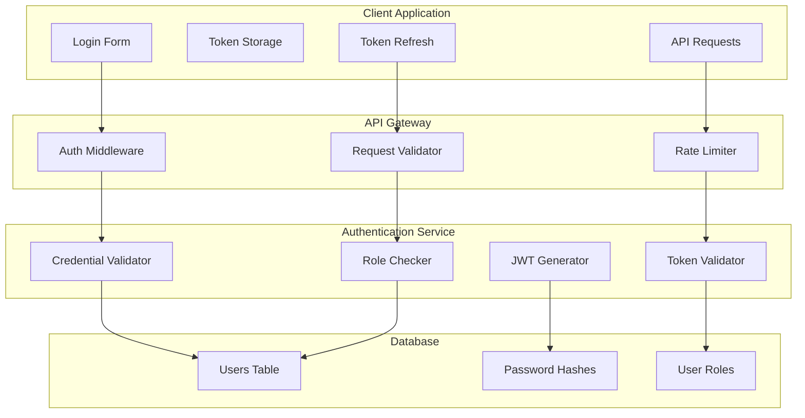
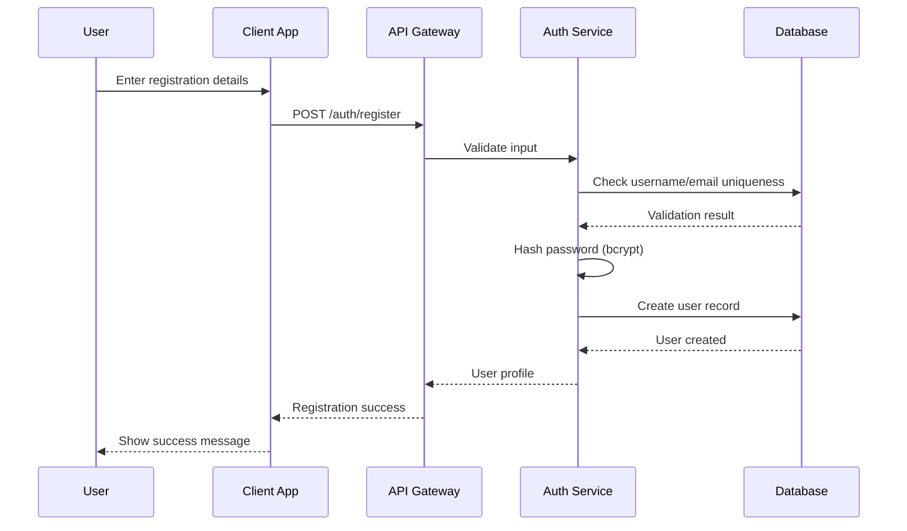
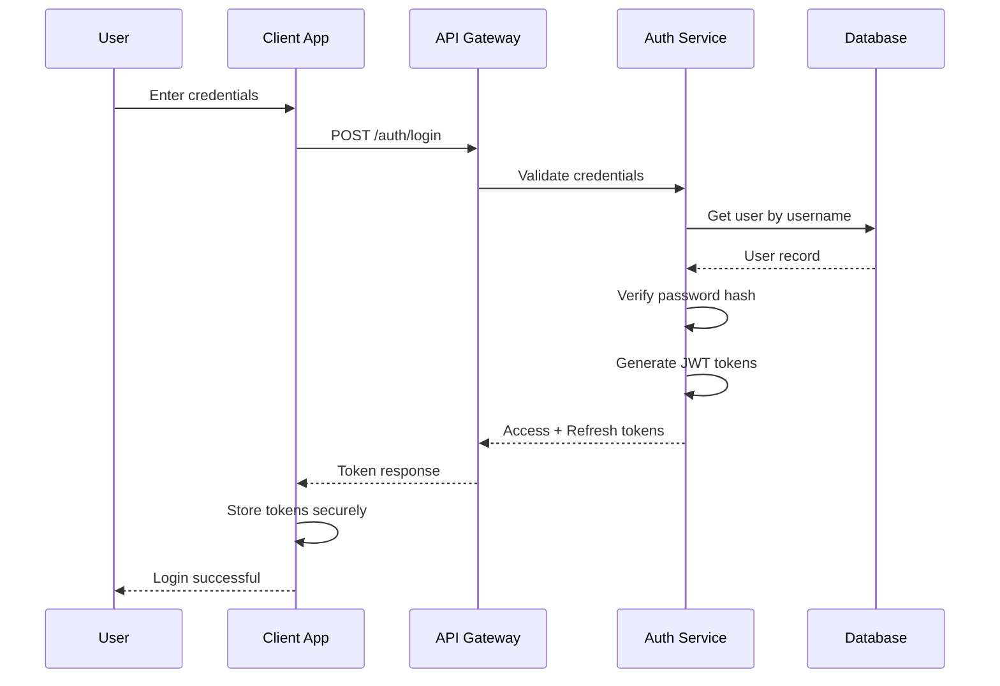
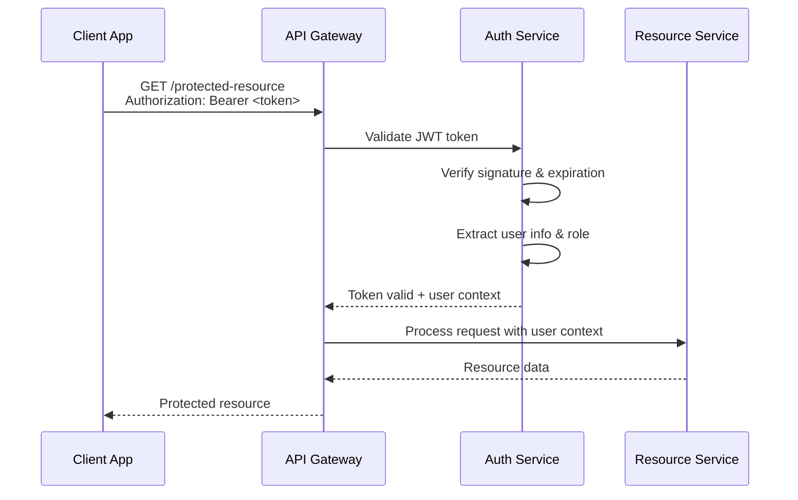
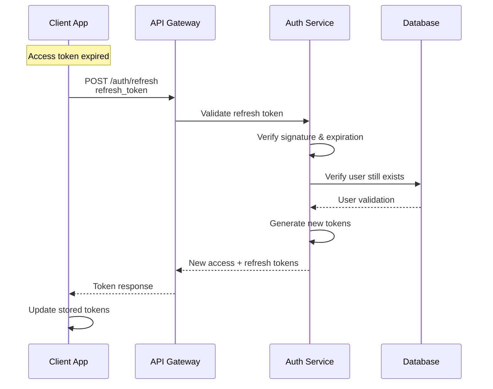

# TalentFlow AI - Authentication Flow Documentation

## Overview

TalentFlow AI implements a secure JWT-based authentication system with role-based access control (RBAC). This document provides detailed information about the authentication flow, security measures, and implementation guidelines.

## Authentication Architecture



## Token-Based Authentication Flow

### 1. User Registration



### 2. User Login



### 3. Authenticated API Request



### 4. Token Refresh



## Security Features

### Password Security

1. **Hashing Algorithm**: bcrypt with salt rounds = 12
2. **Password Requirements**:
   - Minimum 8 characters
   - Recommended: Mix of letters, numbers, symbols
   - No maximum length limit (up to 100 chars)

```python
# Password hashing implementation
import bcrypt

def hash_password(password: str) -> str:
    """Hash password using bcrypt with salt"""
    salt = bcrypt.gensalt(rounds=12)
    return bcrypt.hashpw(password.encode('utf-8'), salt).decode('utf-8')

def verify_password(password: str, hashed: str) -> bool:
    """Verify password against hash"""
    return bcrypt.checkpw(password.encode('utf-8'), hashed.encode('utf-8'))
```

### JWT Token Security

1. **Algorithm**: HS256 (HMAC with SHA-256)
2. **Secret Key**: 256-bit randomly generated key
3. **Token Structure**:

```json
{
  "header": {
    "alg": "HS256",
    "typ": "JWT"
  },
  "payload": {
    "sub": "user_id",
    "username": "jane_recruiter",
    "role": "recruiter",
    "iat": 1642248000,
    "exp": 1642249800,
    "type": "access"
  },
  "signature": "..."
}
```

### Token Expiration

| Token Type | Expiration | Purpose |
|------------|------------|---------|
| Access Token | 30 minutes | API authentication |
| Refresh Token | 7 days | Token renewal |

### Role-Based Access Control (RBAC)

```python
class UserRole(str, Enum):
    ADMIN = "admin"
    RECRUITER = "recruiter"
    HIRING_MANAGER = "hiring_manager"

# Permission matrix
PERMISSIONS = {
    "admin": ["*"],  # All permissions
    "recruiter": [
        "resumes:create", "resumes:read", "resumes:delete",
        "candidates:read", "jobs:read", "scores:read"
    ],
    "hiring_manager": [
        "jobs:create", "jobs:read", "jobs:update", "jobs:delete",
        "candidates:read", "scores:read", "resumes:read"
    ]
}
```

## Implementation Examples

### Client-Side Token Management

```javascript
class AuthManager {
  constructor() {
    this.accessToken = this.getStoredToken('access_token');
    this.refreshToken = this.getStoredToken('refresh_token');
    this.tokenRefreshPromise = null;
  }

  async login(username, password) {
    const response = await fetch('/api/v1/auth/login', {
      method: 'POST',
      headers: { 'Content-Type': 'application/json' },
      body: JSON.stringify({ username, password })
    });

    if (!response.ok) {
      throw new Error('Login failed');
    }

    const tokens = await response.json();
    this.setTokens(tokens.access_token, tokens.refresh_token);
    return tokens;
  }

  async refreshAccessToken() {
    // Prevent multiple simultaneous refresh attempts
    if (this.tokenRefreshPromise) {
      return this.tokenRefreshPromise;
    }

    this.tokenRefreshPromise = this._performTokenRefresh();
    
    try {
      const result = await this.tokenRefreshPromise;
      return result;
    } finally {
      this.tokenRefreshPromise = null;
    }
  }

  async _performTokenRefresh() {
    if (!this.refreshToken) {
      throw new Error('No refresh token available');
    }

    const response = await fetch('/api/v1/auth/refresh', {
      method: 'POST',
      headers: { 'Content-Type': 'application/json' },
      body: JSON.stringify({ refresh_token: this.refreshToken })
    });

    if (!response.ok) {
      this.clearTokens();
      throw new Error('Token refresh failed');
    }

    const tokens = await response.json();
    this.setTokens(tokens.access_token, tokens.refresh_token);
    return tokens;
  }

  async makeAuthenticatedRequest(url, options = {}) {
    let token = this.accessToken;

    // Check if token is expired (client-side check)
    if (this.isTokenExpired(token)) {
      try {
        const refreshResult = await this.refreshAccessToken();
        token = refreshResult.access_token;
      } catch (error) {
        // Redirect to login
        window.location.href = '/login';
        return;
      }
    }

    const response = await fetch(url, {
      ...options,
      headers: {
        'Authorization': `Bearer ${token}`,
        ...options.headers
      }
    });

    // Handle 401 (token expired on server side)
    if (response.status === 401) {
      try {
        const refreshResult = await this.refreshAccessToken();
        // Retry request with new token
        return fetch(url, {
          ...options,
          headers: {
            'Authorization': `Bearer ${refreshResult.access_token}`,
            ...options.headers
          }
        });
      } catch (error) {
        window.location.href = '/login';
        return;
      }
    }

    return response;
  }

  setTokens(accessToken, refreshToken) {
    this.accessToken = accessToken;
    this.refreshToken = refreshToken;
    
    // Store securely (use secure storage in production)
    this.storeToken('access_token', accessToken);
    this.storeToken('refresh_token', refreshToken);
  }

  clearTokens() {
    this.accessToken = null;
    this.refreshToken = null;
    localStorage.removeItem('access_token');
    localStorage.removeItem('refresh_token');
  }

  isTokenExpired(token) {
    if (!token) return true;
    
    try {
      const payload = JSON.parse(atob(token.split('.')[1]));
      return Date.now() >= payload.exp * 1000;
    } catch {
      return true;
    }
  }

  getStoredToken(key) {
    // In production, use secure storage
    return localStorage.getItem(key);
  }

  storeToken(key, token) {
    // In production, use secure storage
    localStorage.setItem(key, token);
  }
}
```

### Server-Side Authentication Middleware

```python
from fastapi import HTTPException, status, Depends
from fastapi.security import HTTPBearer, HTTPAuthorizationCredentials
import jwt
from datetime import datetime, timedelta

security = HTTPBearer()

async def get_current_user(
    credentials: HTTPAuthorizationCredentials = Depends(security),
    db: AsyncSession = Depends(get_db)
) -> User:
    """Extract and validate user from JWT token"""
    
    try:
        # Decode JWT token
        payload = jwt.decode(
            credentials.credentials,
            settings.SECRET_KEY,
            algorithms=["HS256"]
        )
        
        # Extract user information
        user_id = payload.get("sub")
        token_type = payload.get("type")
        
        if not user_id or token_type != "access":
            raise HTTPException(
                status_code=status.HTTP_401_UNAUTHORIZED,
                detail="Invalid token"
            )
        
        # Get user from database
        user_repo = UserRepository(db)
        user = await user_repo.get_by_id(user_id)
        
        if not user:
            raise HTTPException(
                status_code=status.HTTP_401_UNAUTHORIZED,
                detail="User not found"
            )
        
        return user
        
    except jwt.ExpiredSignatureError:
        raise HTTPException(
            status_code=status.HTTP_401_UNAUTHORIZED,
            detail="Token has expired"
        )
    except jwt.InvalidTokenError:
        raise HTTPException(
            status_code=status.HTTP_401_UNAUTHORIZED,
            detail="Invalid token"
        )

def require_role(required_role: str):
    """Decorator to require specific role"""
    def role_checker(current_user: User = Depends(get_current_user)):
        if not has_permission(current_user.role, required_role):
            raise HTTPException(
                status_code=status.HTTP_403_FORBIDDEN,
                detail="Insufficient permissions"
            )
        return current_user
    return role_checker

def has_permission(user_role: str, required_permission: str) -> bool:
    """Check if user role has required permission"""
    if user_role == "admin":
        return True  # Admin has all permissions
    
    user_permissions = PERMISSIONS.get(user_role, [])
    return required_permission in user_permissions
```

## Security Best Practices

### For API Developers

1. **Token Security**
   - Use strong, randomly generated secret keys
   - Rotate secret keys periodically
   - Never log tokens or include them in error messages
   - Implement token blacklisting for logout

2. **Rate Limiting**
   - Implement stricter limits on auth endpoints
   - Use progressive delays for failed attempts
   - Monitor for brute force attacks

3. **Input Validation**
   - Validate all input parameters
   - Sanitize user data
   - Use parameterized queries

4. **Logging and Monitoring**
   - Log all authentication events
   - Monitor for suspicious patterns
   - Alert on multiple failed attempts

### For Client Developers

1. **Token Storage**
   - Never store tokens in localStorage for web apps
   - Use secure, httpOnly cookies when possible
   - Implement secure storage for mobile apps

2. **Network Security**
   - Always use HTTPS in production
   - Implement certificate pinning for mobile apps
   - Validate SSL certificates

3. **Error Handling**
   - Don't expose sensitive information in errors
   - Implement proper logout on token errors
   - Clear sensitive data from memory

4. **Session Management**
   - Implement automatic logout on inactivity
   - Clear tokens on app backgrounding (mobile)
   - Provide manual logout functionality

## Troubleshooting

### Common Issues

1. **Token Expired Errors**
   - Implement automatic token refresh
   - Check system clock synchronization
   - Verify token expiration times

2. **Invalid Token Errors**
   - Verify token format and encoding
   - Check secret key configuration
   - Ensure tokens aren't truncated

3. **Permission Denied Errors**
   - Verify user role assignments
   - Check permission matrix
   - Ensure role-based access is implemented

4. **Refresh Token Issues**
   - Verify refresh token storage
   - Check refresh token expiration
   - Implement proper error handling

### Debug Tools

```bash
# Decode JWT token (for debugging only)
echo "eyJ0eXAiOiJKV1QiLCJhbGciOiJIUzI1NiJ9..." | cut -d. -f2 | base64 -d | jq

# Test authentication endpoint
curl -X POST "http://localhost:8000/api/v1/auth/login" \
  -H "Content-Type: application/json" \
  -d '{"username": "test", "password": "test"}' \
  -v

# Test protected endpoint
curl -X GET "http://localhost:8000/api/v1/auth/me" \
  -H "Authorization: Bearer <token>" \
  -v
```

## Migration and Upgrades

### Token Migration

When upgrading authentication systems:

1. **Gradual Migration**
   - Support both old and new token formats temporarily
   - Migrate users during natural token refresh cycles
   - Monitor migration progress

2. **Backward Compatibility**
   - Maintain API compatibility during transition
   - Provide clear migration timeline
   - Document breaking changes

3. **Security Considerations**
   - Invalidate old tokens after migration
   - Update secret keys
   - Review and update permissions

This authentication system provides a secure, scalable foundation for the TalentFlow AI platform while maintaining ease of use for developers and end users.